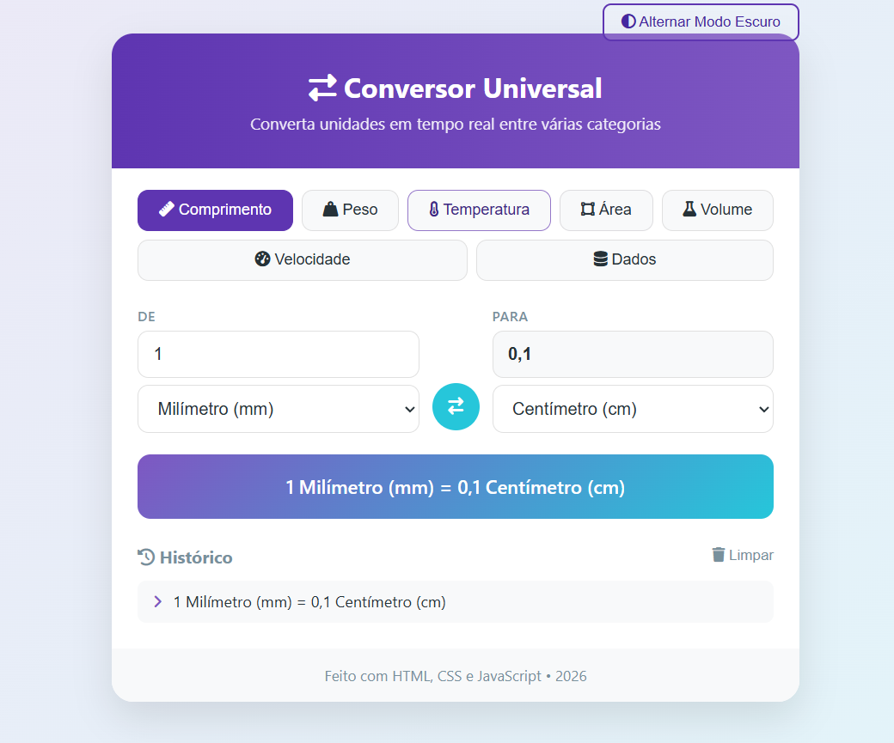

# 🌐 Conversor Universal

[](https://developer.mozilla.org/docs/Web/HTML)
[](https://developer.mozilla.org/docs/Web/CSS)
[](https://developer.mozilla.org/docs/Web/JavaScript)
[](LICENSE)

> Conversor de unidades **moderno e interativo**, feito em HTML, CSS e JavaScript puro
> (sem frameworks). Converte em **tempo real** entre 7 categorias, guarda o **histórico**
> localmente e tem **modo claro/escuro**.

## 🖼️ Demo



## ✨ Funcionalidades

- 🔄 **Conversão em tempo real** — o resultado atualiza enquanto você digita
- 📂 **7 categorias** — Comprimento, Peso, Temperatura, Área, Volume, Velocidade e Dados
- ⇄ **Botão de inverter** unidades (de ↔ para)
- 🕘 **Histórico local** persistente via `localStorage`
- 🌙 **Modo claro/escuro** com 1 clique
- 📱 **Responsivo** — funciona bem em telas pequenas

## 🛠️ Tecnologias

- **HTML5**
- **CSS3** (variáveis, gradientes, responsividade)
- **JavaScript** (lógica de conversão, histórico e interação)
- [Font Awesome 6](https://fontawesome.com) para os ícones

## 🚀 Como rodar

Não precisa de build nem dependências — é só abrir o arquivo:

```bash
# Windows
start index.html
# macOS
open index.html
# Linux
xdg-open index.html
```

> Dica: para evitar qualquer restrição do navegador com arquivos locais, você também pode
> servir a pasta com `python -m http.server` e acessar `http://localhost:8000`.

## 🔢 Categorias e unidades

| Categoria | Unidades |
|-----------|----------|
| Comprimento | mm, cm, m, km, polegada, pé, jarda, milha |
| Peso | mg, g, kg, tonelada, onça, libra |
| Temperatura | Celsius, Fahrenheit, Kelvin |
| Área | cm², m², hectare, km², pé², acre |
| Volume | ml, l, m³, galão |
| Velocidade | m/s, km/h, mph, nó |
| Dados | B, KB, MB, GB, TB |

## 📂 Estrutura

```
Conversor-de-Unidades/
├─ index.html   # estrutura da interface
├─ style.css    # estilos (claro/escuro, responsivo)
└─ script.js    # categorias, conversões e histórico
```

## 📄 Licença

Distribuído sob a licença **MIT**. Veja [LICENSE](LICENSE).
